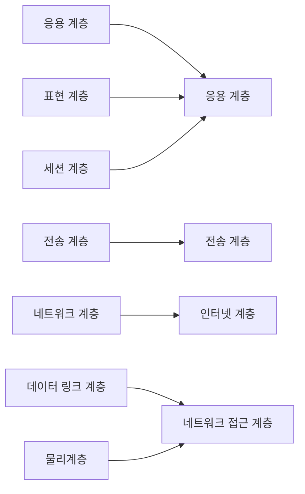
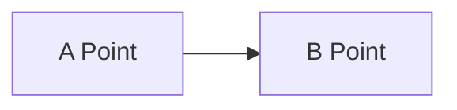
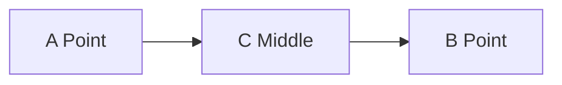

# 개념정리

## 네트워크 프로그래밍이란?
 네트워크?
 - 네트워크(Network)는 Net + Work의 합성어이다. 한마디로 통신을 하기위해 서로 연결된 망이라 할 수 있다.
 
네트워킹?
- 네트워크에 연결된 장비들간의 데이터 전송 과정
> 장비들 간 통신 데이터는 바이너리 형태의 시퀀스이다. 
> 네트워킹 간 통신 규약을 **프로토콜**이라 한다. (정보 공유를 위한 약속)
	
네트워크 통신?
   -  네트워크에 연결된 장비들간의 데이터 전송
   - 네트워크 통신에는 주소(IP + Port) + 데이터가 필요하다.
> End System? 데스크탑, 컴퓨터, IOT 등 인터넷과 연결되는 장치를 의미, 호스트(host)
> Network Edge? 네트워크 가장자리에 있는 End System을 지칭함.
> Access Network? End System <-> End System의 사이의 경로상에 있는 첫 번째 라우터

네트워크 프로그래밍이란?
- 두 디바이스간 네트워크 통신을 통해 데이터를 송수신 할 수 있도록 프로그래밍하는 것이다.
- 네트워크 프로그래밍은 소켓을 이용하여 통신을 한다.
> 소켓? 네트워크 통신 연결 도구, 각 운영체제에 의해 제공되는 소프트웨어적 장치

## TCP/IP 4계층으로 보는 네트워크 통신
### TCP/IP 4계층
- OSI 7계층을 조금더 단순화 시킨 4개의 계층(Layer)으로 분류될수 있다

 - 해당 계층들의 역할은 OSI 7계층 해당하는 역할을 수행한다. 

> OSI 7계층에서 각각의 역할(간단)
>  - 응용 계층 : 응용 서비스를 수행한다. (소프트웨 UI 부분 즉, 인터페이스 제공)
>  - 표현 계층 :  데이터 표현에 차이가 있는 응용 프로세스간 독립성 및 암호화 제공
>  - 세션 계층 : 통신 세션을 구성하는 계층으로, 포트 연결을 통해 세션을 관리한다.(통신장치간 동기화 등)
> - 전송 계층 : (End to End) 종단간 메세지에 대한 제어와 에러를 관리, 신뢰성 있는 통신을 보장하기 위해  몇가지 검사를 한다.(주소 설정, 오류 제어 등)
>  - 네트워크 계층 : 데이터 패킷을 받아 데이터 종류와 상관없이 다른 호스트로 전달 
>  (송신지/수신지 필드를 갖는다)
> - 데이터 링크 계층 : 패킷 데이터를 신뢰성있는 전달을 위해 오류/흐름 제어기능을 수행 후 물리계층에 전달 (특징적인 점은 노드 대 노드)
> - 물리 계층 : 데이터 패킷 정보를 물리적 신호로 변환하여 송수신

- TCP 계층으로 보는 데이터 전송
	- WWW 예시를 통해 실제 TCP/IP 4계층을 통해 데이터가 전송을 확인
		1.  응용 계층에서 사용자 인터페이스를 통해 데이터 전달 시작
			> HTTP 프로토콜을 이용하여 데이터 패킷을 생성 후 전달
		2. 
		3. 
		4. 
		
### TCP & UDP
> TCP / UDP는 전송계층에 해당한다.(OSI, TCP/IP Layer)
- TCP 
	- 신뢰성 있는 연결
- UDP
	- 신뢰성 없는 연결
	- 실시간 응용 및 멀티캐스팅
	- 헤더의 단순함
### Http 통신 / Socket 통신 
- HTTP 통신 
- SOCKET 통신
- HTTP & SOCKET 
## 소켓 통신
### 소켓 
- 네트워크를 통해 End System간 수행되는 프로세스간 통신 채널. 즉, 네트워크 환경에 연결할 수 있게 만들어진 연결부라고 볼 수 있다. 소켓은 TCP/IP 소켓와 UDP 소켓으로 분리할 수 있다.

### 소켓 서브루틴이란
 - 프로세스 / 네트워크 통신을 가능하게 해주는 부분을 총칭
 - 간단한 예로 bind, listen와 같은 소켓통신을 위한 함수들을 의미한다.
> 루틴이란? 컴퓨터 프로그래밍에서 어떤 일을 담당하는 하나의 정리된 일을 뜻한다. 이는 일부를 표시하는 경우도 있고 전부를 표시하는 경우도 있다.
> 메인루틴(Main routine) + 서브루틴(Sub routine) = 루틴 으로 구성된다.
> 메인루틴 : 프로그램의 주요한 부분으로 전체의 개략적인 동작 절차를 표시하며, 서브루틴을 실행시킨다.  (보통 메인문)
> 서브루틴 :  프로그램의 일부를 담당하는 부분(보통 언어에서는 함수나 메소드 등으로 불림)
 
### 소켓의 종류
- SOCK_DGRAM 
	- 명시적으로 연결을 맺지 않는 비 연결형 소켓, 특정 주소로 메시지를 보내면 다른 소켓은 연결상태와 상관없이 받기만 하면된다.
	- 해당 소켓의 주소로 보내기만 하기 때문에 데이터 파손이나 분실에 대해서는 알 수 없다.
	- 전송할때 데이터 경계가 존재하며 한번에 전송할 데이터 크기가 제한된다. 
		> 데이터를 n번 나눠서 보냈을때, n번 나눠서 받아야 할 경우 **전송되는 데이터의 경계가 존재** 라 지칭함.
	- 비 연결지향형 소켓이며 비 신뢰성 프로토콜인 UDP 통신을 할때 사용된다.
- SOCK_STREAM
	- 연결 상태를 유지하는 연결형 소켓, 1대1 통신이며 바이트 스트림으로 데이터를 양방향으로 전송하여 송수신이 가능하다.
	- 오류수정, 전송처리 등을 통해 중간에 데이터가 소멸되지 않고 목적지로 전송되며 전송 순서대로 데이터를 수신한다.
	- 수신된 데이터는 버퍼에 저장되는데, 버퍼의 용량이 초과하지 않는 한 n번 호출을 통해 읽을 수 있고 또는 한번에 읽을 수 있다. 이를 **'데이터 경계가 존재하지 않는다'** 라고 한다.
	- 연결지향형 소켓이며 신뢰성 프로토콜인 TCP 통신을 할때 사용된다.
- SOCK_RAW
	- 내부 네트워크 프로토콜과 인터페이스 접근을 지원
	- Root 계정 사용자만 다룰 수 있다.
	- 해당 소켓은 패킷을 가져오게 되면 TCP, UDP 계층을 우회하여 바로 어플리케이션에 송신한다. 이를 통해 원형으로 패킷을 볼 수 있다.
	- 실제 프로그래밍 할일은 없지만, 간혹 패킷 분석 프로그램같은 시스템을 만들때 필요하다.
> SOCK_RAW에 대해서는 안써봐서 잘모르겠다. 

### TCP/IP 소켓 
-	

## 기타 설명
### Point to Point?
	- 네트워크 형태가 1대1 구조이다.
### End to End?
	- 양 종단간의 통신을 일컫는다. 즉, End Syste끼리의 통신

### End to End 와 Point to Point 다른점
Point to Point

End to End 

	- Point to Point는 다이렉트 연결이지만 End to End는 중간에 다른 연결지점(Middle Ware)이 하나더 있다.